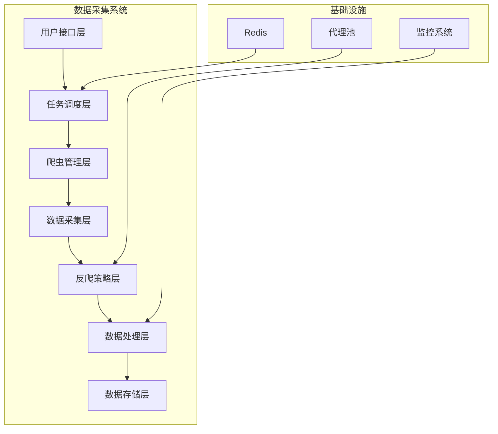
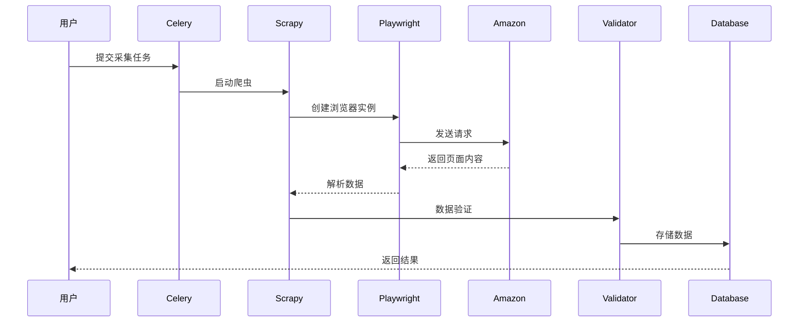

# 系统架构设计

## 整体架构

亚马逊电商平台商品数据智能采集系统采用分层架构设计，包含数据采集层、反爬策略层、数据处理层和任务调度层。

## 核心组件

### 1. 任务调度层 (Celery)
- **功能**: 分布式任务调度与执行
- **技术**: Celery + Redis
- **职责**: 
  - 定时任务调度
  - 任务分发与负载均衡
  - 执行状态监控

### 2. 爬虫管理层 (Scrapy)
- **功能**: 爬虫生命周期管理
- **技术**: Scrapy框架
- **职责**:
  - 爬虫实例创建与销毁
  - 请求调度与响应处理
  - 中间件管理

### 3. 数据采集层 (Playwright)
- **功能**: 网页内容采集与交互
- **技术**: Playwright + Chromium
- **职责**:
  - 动态内容渲染
  - 页面交互模拟
  - 数据提取

### 4. 反爬策略层
- **功能**: 绕过网站反爬机制
- **技术**: 多种反爬技术组合
- **职责**:
  - User-Agent轮换
  - IP代理池管理
  - 浏览器指纹伪装
  - 行为模拟

### 5. 数据处理层
- **功能**: 数据清洗与验证
- **技术**: Pandas + 自定义验证器
- **职责**:
  - 数据格式标准化
  - 质量验证
  - 异常数据处理

## 数据流

## 配置参数

### 爬虫配置
- 并发请求数: 1 (防止被检测)
- 下载延迟: 10秒 (随机化)
- 重试次数: 5次
- 超时时间: 60秒

### 反爬配置
- User-Agent池: 10个随机User-Agent
- 代理池: 支持自定义代理列表
- 行为模拟: 页面滚动、随机等待
- 浏览器特征: 指纹伪装

## 扩展性设计

系统采用模块化设计，支持以下扩展：

1. **水平扩展**: 通过增加Celery工作节点实现分布式采集
2. **功能扩展**: 通过插件机制扩展新的采集策略
3. **平台扩展**: 支持其他电商平台的采集适配
4. **存储扩展**: 支持多种数据存储后端

## 安全考虑

- 数据加密传输
- 代理IP轮换
- 请求频率限制
- 用户隐私保护